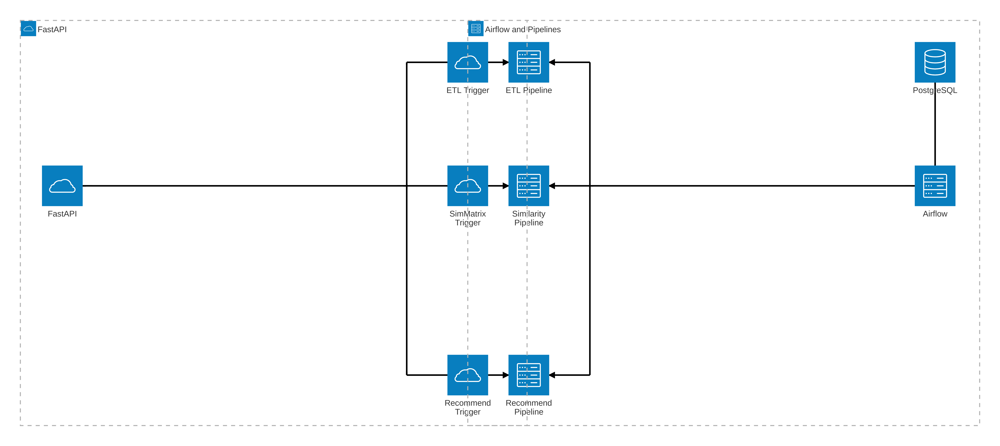
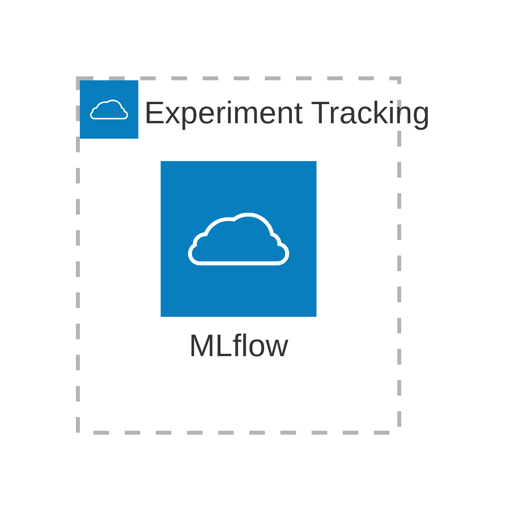
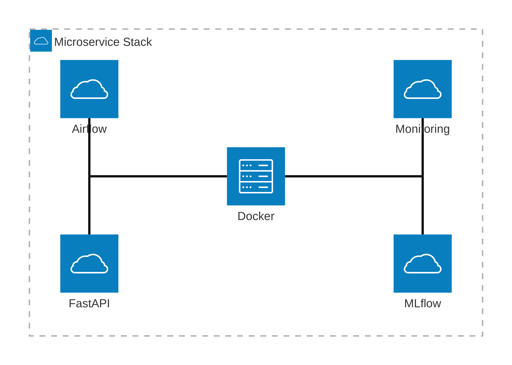
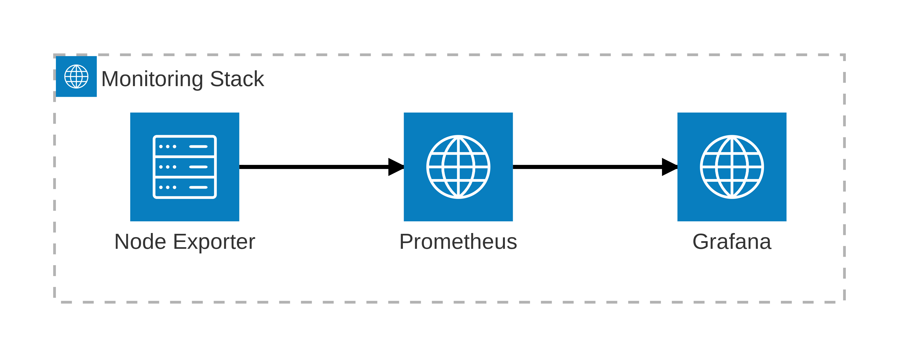

# Rakuten E-Commerce Product Classification (Multimodal)

Cataloging products based on heterogeneous data sources (text and images) is a core task in modern e-commerce systems. Accurate product classification enables downstream applications such as recommendation systems, personalized search, and catalog quality control.

This project addresses a **multimodal classification problem**: predicting the product type code using **textual information** (product designation and description) and **visual information** (product images).

---

## Data

The dataset is publicly available as part of the challenge and can be accessed here:  
🔗 https://challengedata.ens.fr/challenges/35

**Dataset characteristics**
- ~99,000 product entries
- 1,000+ product classes (highly imbalanced)
- Text data: ~60 MB
- Image data: ~2.2 GB
- Noisy real-world e-commerce data

The dataset reflects realistic challenges such as class imbalance, heterogeneous text quality, and varying image resolution.

---

## Problem Framing & Approach

The task is formulated as a **supervised multi-class classification problem**.

High-level workflow:
1. **Data ingestion & validation**
2. **Text preprocessing & embedding**
3. **Image preprocessing & feature extraction**
4. **Model training**
   - text-only baseline
   - image-only baseline
   - multimodal fusion models
5. **Evaluation & error analysis**
6. **Interactive exploration via Streamlit**

The project deliberately emphasizes **model interpretability, reproducibility, and modular design**, rather than pure leaderboard optimization.

---

## 📁 Project structure
```text
├── airflow 							— Workflow orchestration (pipelines, scheduling)
│   ├── dags							— definition of pipelines incl trigger
│   └── logs							— log files on pipeline execution
│       ├── dag_process_manager			— general dashboard configurations as yaml file
│       └── scheduler					— 
├── data
│   ├── input							— folder containing new / incoming data
│   ├── lake							— folder containing pre-checked data used in ETL pipeline 
│   └── done							— folder containing data after processed in ETL pipeline 
├── fastapi								— API deployment
├── logs								— log files from running 'src' or 'script' files
├── mlflow								— experiment tracking
│   ├── artifacts						—
│   └── data							—
│       └── artifacts					—
├── monitoring							— monitoring of infrastructure and application (= API)
│   ├── grafana							— visualising monitoring data as dashboards
│   │   ├── dashboards					— configurations of customized dashboard as json file
│   │   └── provisioning				
│   │       ├── dashboards				— general dashboard configurations as yaml file
│   │       └── data_sources			— data source definition as yaml file
│   └── prometheus						— scraping data from infrastructure and API
│       └── rules						— alert rules (as yaml file)
├── scripts								— contains Shell scripts
├── src 								— contains Python scripts
│   └── utils 							— contains py-files of helper functions, class definitions,...
├── streamlit 							— frontend: presentation / live demo of project
│   ├── logs 							— log files used for streamlit app
│   ├── pages 							— pages from streamlit app
│   ├── src 							— contains Python scripts and a py-file of utility functions
│   │   ├── codes
│   │   └── screenshots
│   └── static_files
└── tests
```
The repository follows the principles of the *cookiecutter data science* template, with additional components for MLOps experimentation and interactive visualization.

--------

## Key Components    
- **[`Makefile`](./Makefile)**   
  shortened commands for often executed files 

- **[`scripts/`](./scripts/)** 
  Reusable shell scripts
  
- **[`streamlit/`](./streamlit/)**  
  Interactive presentation of the project including some live demos.

- **[`src/`](./src/)**  
  Reusable Python scripts for preprocessing, training, and evaluation. Moreover, a 'utils' module containing helper functions, classes and similar. 

--------
## Architecture Overview
### General overview

 

### Software descriptions
#### (1) Orchestration and Pipelines

**What is the use of 'Airflow'?** 
- Orchestrates and automates data preprocessing and feature pipelines via DAGs
- Handles scheduling and retries of ML processes 
- Ensures reproducibility and traceability   

**What is the use of 'FastAPI'?** 
- Python framework for quickly building web APIs   
- Lightweight HTTP interface   
- Decouples UI from orchestration

 

#### (2) Experiment tracking
**What is the use of 'MLflow'?** 
- Central tool for tracking ML experiments   
- Logs parameters, metrics, models, and artifacts  
- Makes ML experiments reproducible and comparable

 
 
#### (3) Microservice structure
**What is the use of 'Docker'?**   
- Containerized execution of services and applications   
- Reproducible runtime environments across development and deployment   
- Isolation of dependencies for API, UI, and other infrastructure components
- Allows a microservice architecture and portability (**DockerHub**)

 

#### (4) Monitoring
**What is the use of 'Prometheus'?**   
- Collection of system and application metrics via HTTP endpoints   
- Time-series storage for on-going monitoring of infrastructure, application and model    
- Basis for alerting and operational observability

**What is the use of 'Grafana'?**   
- Visualization of metrics from Prometheus and other data sources   
- Interactive dashboards for monitoring data   
- Support for trend analysis and anomaly inspection   
- dashboards = IaC: portable/exchangable, versionable, less human errors,... 

**What is the use of 'Node-exporter'?**   
- Centralized aggregation of application and service logs   
- Lightweight log indexing optimized for metric correlation   
- Integrated log exploration within Grafana dashboards   

 

--------

## Project Information
## Prerequisites
+ python 3.11.x
+ Git
+ Python venv

--------

## Setup Guide (Streamlit app)

```bash
# (1) Activate venv (for Linux and macOS)
source .venv/bin/activate

# (2) Install the basically required packages
pip install -r requirements.txt

# (3) Run the streamlit application:
streamlit run streamlit/app.py

# (4) Open your browser and navigate to `http://localhost:8501` to view the application.
```

## Setup Guide (Project)

```bash
# (1) activate virtual environment
source .venv/bin/activate

# (2-A) install core dependencies
pip install -r requirements.txt

# (2-B) install mlops dependencies
pip install -r requirements-mlops.txt

# (2-C) install mlops and heavy dependencies
pip install -r requirements-heavy.txt

# (2-D) install all dependencies (mlops, heavy and dev)
pip install -r requirements-dev.txt
```

--------

<p><small>Project based on the <a target="_blank" href="https://drivendata.github.io/cookiecutter-data-science/">cookiecutter data science project template</a>. #cookiecutterdatascience</small></p>
